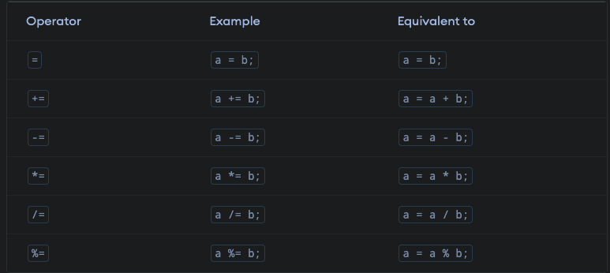
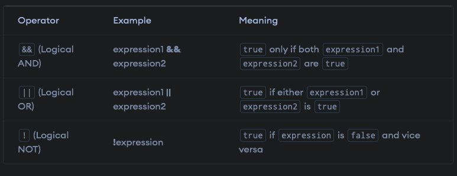

# Operation

## Java Arithmetic Operators

- Addition(+)
- Subtraction(-)
- Multiplication(\*)
- Division(/)
- Modulo Operation (Remainder after division) (%)

## Java Assignment Operators

## Java Relational operator

## Java Logical operator

## Ternary operator (()? "" : "")
